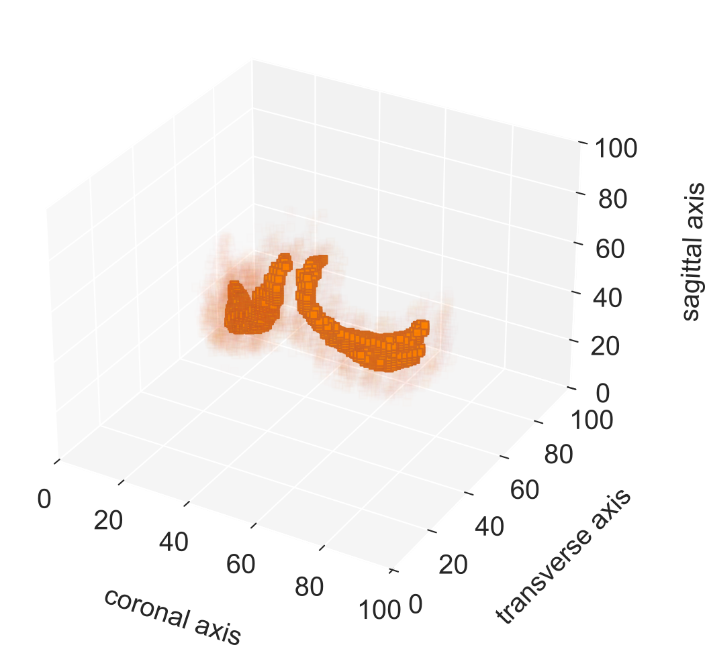
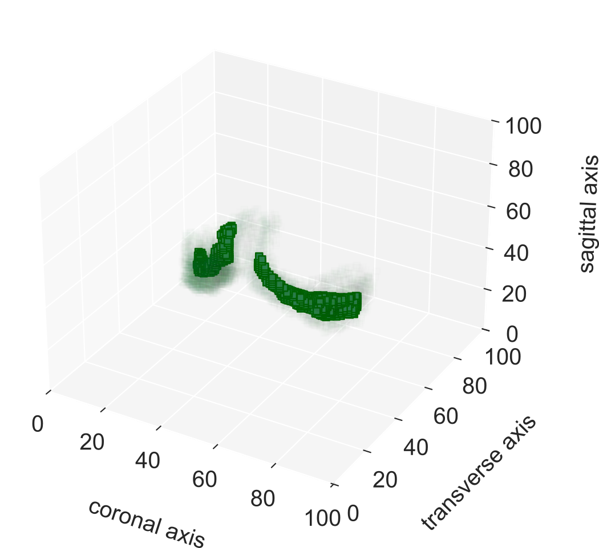

# Brain Structure Generative Models
## Description
This project contains implementations of 3D Conditional Variational Autoencoders as well as Bernoulli Diffusion Autoencoders and Gaussian Diffusion Autoencoders.
Additionally, an implementation of a 3D convolutional classifier is given.
The models are used to generate 3D segmentation masks of the Choroid Plexus based on different MS types, but all models can be applied to other scenarios as well and can be used to generate new data and explor underlying data structures.

The implementation if the bernoulli diffusion process is based on https://github.com/takimailto/BerDiff and the diffusion autoencoder is based on https://github.com/phizaz/diffae.

## Visuals
Two examples for generated prototypes (with original data as shadow in the back, showing variance)
<p float="left">
   </img>
   </img>
</p>

## Installation

### Git LFS
The repository contains 3D segmentation masks and trained models, which are added using git lfs.
If not done already, please install git lfs. A useful manual can be found here: https://josh-ops.com/posts/add-files-to-git-lfs/.
Git lfs should be configured for following file types: `*.psd` `*.pkl` `*.npz` `*.pt`.
To add single files use `git lfs track --filename [file path]`.

### Python Packages
You need a python package manager like anaconda to create an environment or use a virtual environment with pip.
For the installation please use the given `environment.yml` as it contains all necessities to run the project. <br><br>
**Before installing the packages**, make sure that the pytorch cuda version suits your cuda version or use the cpu pytorch package (this is the default option).
If you use cuda, please refer to https://pytorch.org/get-started/locally/ for instructions on how to get the right version.
Then update version details in the environment yml e.g.:
```
- torch --index-url=https://download.pytorch.org/whl/cu121 <-- your cuda version
- torchvision --index-url=https://download.pytorch.org/whl/cu121 <-- your cuda version
``` 

Then install all packages as defined in the environment file:
```
conda env create -f environment.yml
```
Then you can activate your conda environment and start working with the project:
``
conda activate mec_brain
``
If you need to lik conda before, use `source ~/anaconda3/etc/profile.d/conda.sh`. 
Alternatively, you can install the listed packages via pip in a virtual environment without using the environment file.

### Git and Jupyter Notebook
Add the following to your local `.git/config` for development to avoid any problems using git and jupyter notebook:
```
[filter "strip-notebook-output"]
clean = "jupyter nbconvert --ClearOutputPreprocessor.enabled=True --ClearMetadataPreprocessor.enabled=True --to=notebook --stdin --stdout --log-level=ERROR"
```

Now you are ready to work with the project.

## Usage
Here are some examples on how you can run the program. One for training a model and one for analysing an already trained model.
First you need to activate your python environment.
Afterward, checkout the `variable.py` and set your paths etc as you wish.
Make sure that the correct device is being used.
Some files set the cuda device separately, please be aware of that!

To get a first impression of the models and how they are configured please take a look at the tests in the `tests` folder.
### Training
For training a new model you need to first create a config.
Use the `BaseConfig` as starting point. Go to the `run_models` folder, containing configurations and running/tuning scripts for the models.
You can add a new folder for your model there or modify the existing ones.
1. Add your template to `model_templates.py` or use an existing config.
2. Create/Use existing model (there exist one folder per model). The k fold split config is not set yet in the variables.py. If you want to use them please add them as for the other models.
   3. `tune_hyperparameters.py` contains a tuning script with ray, simply edit the config and run it. WHen the cuda device is set explicitly, please use only 'cuda' in the `variables.py`. Otherwise, remove explicitly setting of cuda devices in corresponding files.
   4. `train.py` for simply training the mode.
   5. If you want to fine tune a pretrained model set `checkpoint["name"] = "path_to_your_model"` of the conf.
### Analysis
For the analysis go to the `src/analysis` folder. You can run the `analysis.ipynb` AFTER you created all corresponding files with the `pipelines`
1. Run pipelines for your model. Use the `run_pipelines.py. There are examples (commented out) how I used the pipeline with json configurations. The configs are saved in the model folder. Otherwise, you can also run the pipeline independently for your models as in the example which is not commented out. For the trained models, the corresponding config is saved within the `models` folder.
2. Now you can run the `analysis.ipynb`. Please set the model name accordingly, if you use a new model, add the name to the `_types.py`  file as it is already done for trained models and has been used for assessing model evaluation metrics, generation ability and to evaluate geometric properties. The notebook can be improved regarding structure and format, feel free to adapt it for your needs.

### Monitoring Training:
To monitor the training start the Tensorboard: 
+ When running test scripts: `tensorboard --logdir tests/runs`
+ When running from notebooks in main folder: `tensorboard --logdir ./runs`

For the case you are running the model on a remote server make sure that you forward the outputs to your local machine 
(`ssh -L 6006:127.0.0.1:6006 user@server`)

## Project structure 
* **data**: Folder that contain all your data and training csvs
* **docs**: Documentation with Sphinx
* **models**: You can save your model resutls here
* **reports**: Containing detailed results you can collect via training, is also used as plotting directory (if you want to use it add an empty figures folder)
* **run_models**: Contains run configurations and function for our model implementations (working ony with our checkpoints and data)
* **src**: Main project related files:
  * **analysis**: An analysis notebook and corresponding evaluation files, additional pipelines for preparing data for the evaluation, running evaluation and running the analysis. The analysis.ipynb is a playground for visualising and assessing results.
  * **data**: Data related scrips, such as for data loading and the creation of datasets.
  * **models**: Containing the main implementations of a CVAE, GDAE, and BDAE. All models inherit the same autoencoder base class and can be configured via a given `config`. Additionally, the fodler contains a `trainer.py` which is a trainer script that can be used to train validate and test your models. Each folder contains one model implementation.
  * **utils**: A folder containg all utility function used for training and data handling.
* **tests**: Folder containing test files for the project. Since a lot of the project structure changes, not all tests are up to date. Data laoding test rely on our dataset and may fail for others, as they assess size and dimensionality.
*  `environment.yml` file containing specification of the anacodna environment.
*  `variables.py` main file where to hardcode project specific paths and patterns
## Authors and acknowledgment
The project is mainly based on the implementations of https://github.com/takimailto/BerDiff and https://github.com/phizaz/diffae, who made their code open source.
It is really appreciated.

## License
The project is licenced under the MIT license (further information in license file)

## Project status
As the project was tailored to a specifc use case, all functionalities might not work out of the box in a new project setup. Please be aware of this. Modifications and tests with open source data and models, making it broadly applicable will follow.

## Debugging
During the project I ran into some environment issues because of version mismatches, following link helped fixing issues after reinstalling all dependencies:
https://stackoverflow.com/questions/76309946/conda-attributeerror-module-brotli-has-no-attribute-error-after-update

## Dataset
The dataset contains 3D nnUNet segmentations of the Choroid Plexus, acquired from MRI data from patients with different manifestations of MS and without MS.
The test dataset `test3D.npz` is only added for data loading purposes and testing.
It is from the MedMNIST dataset and is licensed under the **Creative Commons Attribution 4.0 International (CC BY 4.0)** license:
* Jiancheng Yang, Rui Shi, Donglai Wei, Zequan Liu, Lin Zhao, Bilian Ke, Hanspeter Pfister, Bingbing Ni. Yang, Jiancheng, et al. "MedMNIST v2-A large-scale lightweight benchmark for 2D and 3D biomedical image classification." Scientific Data, 2023.
* Jiancheng Yang, Rui Shi, Bingbing Ni. "MedMNIST Classification Decathlon: A Lightweight AutoML Benchmark for Medical Image Analysis". IEEE 18th International Symposium on Biomedical Imaging (ISBI), 2021.<br>

For more details, see the official  [MedMNIST page](https://medmnist.com/).
The same applies to the Choroid Plexus segmentations
